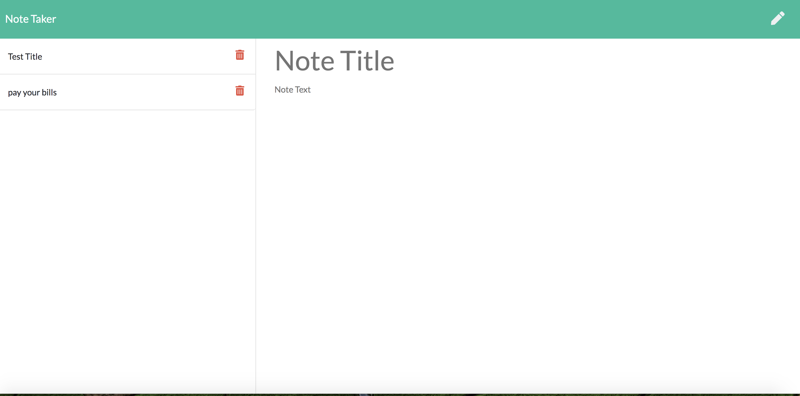

# Note-taker

## Description:

This application was created to write and save notes. The notes can be deleted as well, bu clicking on the trashcan icon. The application will be launched by Heroku. 

## Table of Contents

* Installation
* Dependencies
* Testing
* Contribute
* Questions

## Installation

## Dependencies

You will need Express and uuid if you want to clone or fork.

## Testing

## Contribute

## Questions
 If you are interested in contributing with this application, my github user name is Dobinator and my email is dobsonemily@gmail.com

